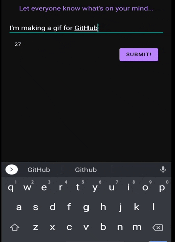

# Yourpinions
A simple Android app designed to let users express their opinions while other users judge your deepest thoughts with their votes. This project is carried out for Boost Malaysia's interview coding challenge.

## Features
* Displays top 20 Yourpinions on the main page.
* Add a Yourpinion that is up to 255 characters long.
* Upvote and downvote Yourpinions.

## Current Technical Features
* Uses Android Architecture Components to implement the MVVM pattern.
* Uses Firebase Realtime Data to store and retrieve Yourpinions in the repository. To store a new Yourpinion, a Yourpinion class is saved to the database. This then parses the object into an entry with a UID, opinion and vote count. To upvote or downvote, the UID of the Yourpinion in focus is used to update its value in the database. Although this might not be a problem for a small user base, ideally transactions should be used to keep track of upvotes and downvotes in the future.
* The ViewModel retrieves a LiveData<ArrayList< Yourpinion >> object from the repository which then allows the fragment to observe and dynamically refresh a RecyclerView on the main page. This allows the data to live in the process, respect Android lifecycles and does not require data persistence. This also gives the benefit of letting the RecyclerViewAdapter in the Fragment to observe data as it is being fetched from the repository, allowing users to view the most up to date data on their UIs.
* Uses a single Activity with multiple fragments with backstacks. As the activity across all the fragments needed the same core functionality, this felt like the right design choice. Backstacks make it easier for users to navigate their way through the app.
  
## Future Work
* Using transactions to update Firebase Realtime Data to avoid vote count miscalculations when multiple users vote at the same time.
* Fix Mockito inline to allow for Android UI Tests.
* Utilise dependency injection for the repository.
